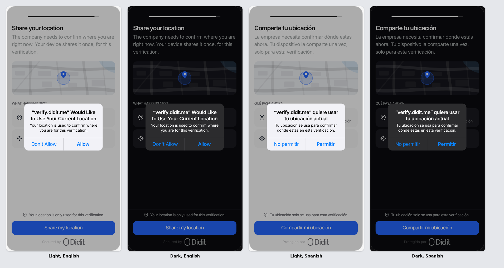
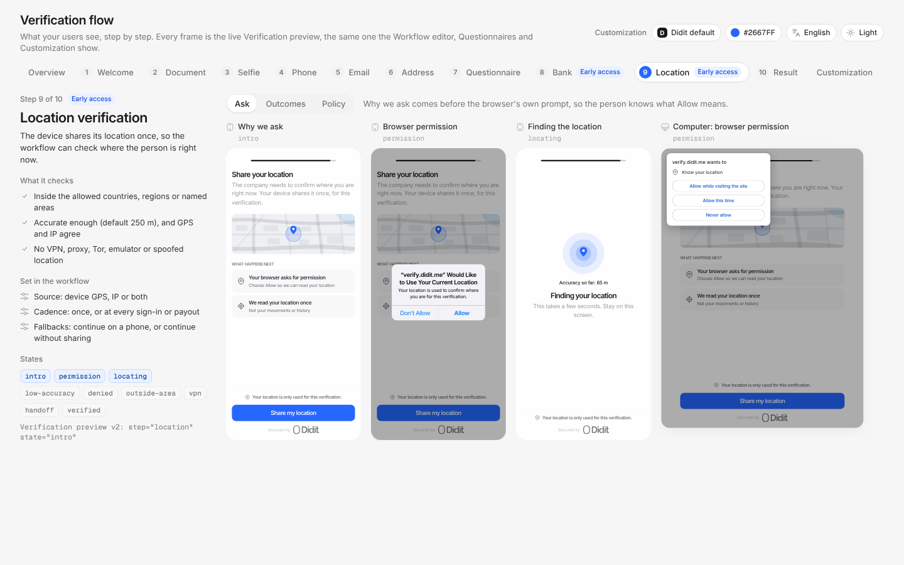
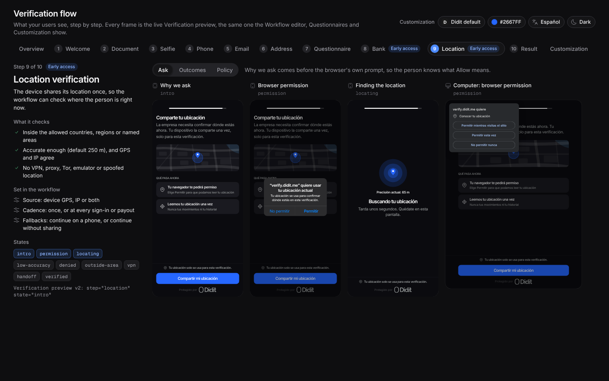
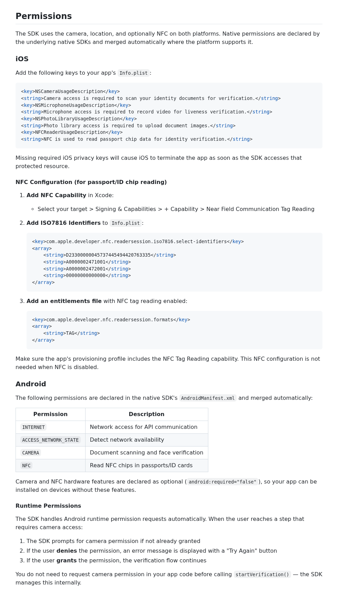
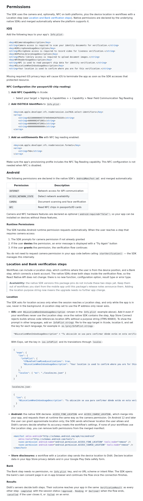
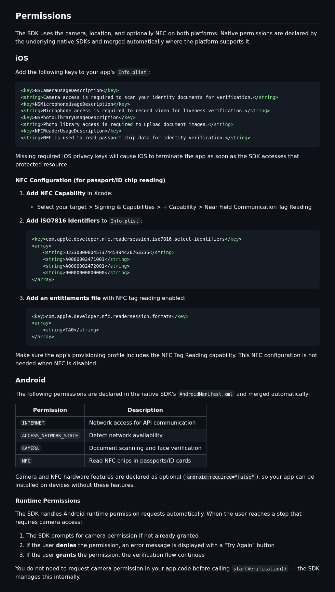
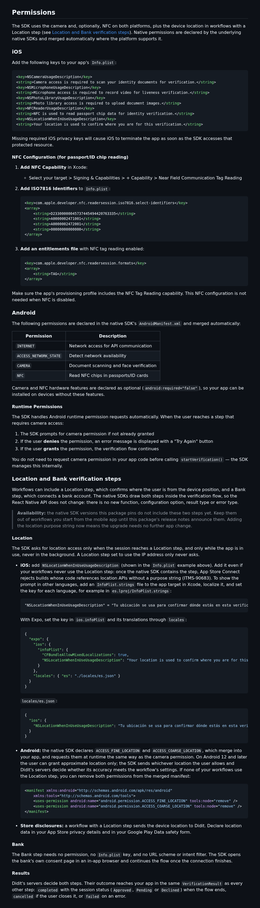

# Proof: React Native wrapper, Bank and Location steps

This wrapper draws no screens. The native SDKs draw the Bank and Location steps (ES2-ES5), and their pull requests carry the screenshot tests. In this change, people can see two things:

1. The location permission prompt in the example apps. Its text is `NSLocationWhenInUseUsageDescription`.
2. The README's Permissions section.

## 1. Location permission prompt copy (design reference)

The example apps' `NSLocationWhenInUseUsageDescription` and the README's Spanish `InfoPlist.strings` line use the design's permission-prompt text word for word. The source is the `VerificationFlow` board, step `location`, frame "Browser permission", rendered with `brand=didit`. Each crop is at 2x:



Full board frames for context:





I could not capture the running example app here, for two reasons:
- The pinned native SDK (4.9.0) has no Location step, so nothing in the app asks for location yet.
- This Linux sandbox has no iOS simulator or Android emulator.

Once the native release with ES2-ES5 is pinned, the supervisor captures the example app's real prompt on a Mac, in light, dark and Spanish. On iOS the system dialog's title names the app rather than the web host, and its body is the purpose string shown above.

## 2. README, Permissions section (GitHub rendering)

Before (light):



After (light):



Before (dark):



After (dark):



## Tests

`yarn lint && yarn typecheck && yarn test --maxWorkers=2`: lint and typecheck clean, 6 suites and 53 tests passed (39 before this change, 14 new). `yarn prepare` (bob build) passed. `npx expo config --type introspect` in `example-expo` resolves `ios.infoPlist.NSLocationWhenInUseUsageDescription` to the same string.

```
PASS src/__tests__/location-permission-entries.test.ts
  location purpose string
    ✓ is declared in example/ios/SdkReactNativeExample/Info.plist
    ✓ is declared in example-expo/ios/DiditExpoExample/Info.plist
    ✓ is declared in the Expo example app.json
    ✓ is the one the README tells integrators to add
    ✓ is documented with the same Spanish translation for bare and Expo apps
  Expo example native project
    ✓ declares exactly the usage descriptions of its app.json, with the same copy
  Android example location permissions
    ✓ declares ACCESS_FINE_LOCATION so precise and approximate grants both work
    ✓ declares ACCESS_COARSE_LOCATION so precise and approximate grants both work
PASS src/__tests__/index.test.tsx
  Bank and Location steps pass-through
    ✓ forwards the language to native when starting with a session token
    ✓ forwards the language to native when starting with a workflow
    ✓ returns a session the server decided as Approved as a completed result
    ✓ returns a session the server decided as Pending as a completed result
    ✓ returns a session the server decided as Declined as a completed result
    ✓ keeps the native message when a newer native step reports an error type the bridge does not know

Test Suites: 6 passed, 6 total
Tests:       53 passed, 53 total
```
