# Visual proof

This wrapper draws no screens: the native SDKs draw the Bank and Location screens, and iOS draws the permission prompt. A person sees three things from this change: the location prompt text in the example apps, the README's new Bank and Location section, and the README error table's new `retryBlocked` row.

## Location permission prompt: design reference

These are the design frames (phone, 390x844). Both example apps declare their prompt body word for word, in English in `Info.plist` / `app.json` and in Spanish in `es.lproj/InfoPlist.strings` / `locales/es.json`. `src/__tests__/location-permission-entries.test.ts` checks every one of these strings. The real iOS prompt can't be captured yet: native SDK 4.9.1, the version this package pins, has no Location step, and this Linux sandbox has no iOS simulator.

| | Light | Dark |
|---|---|---|
| English | 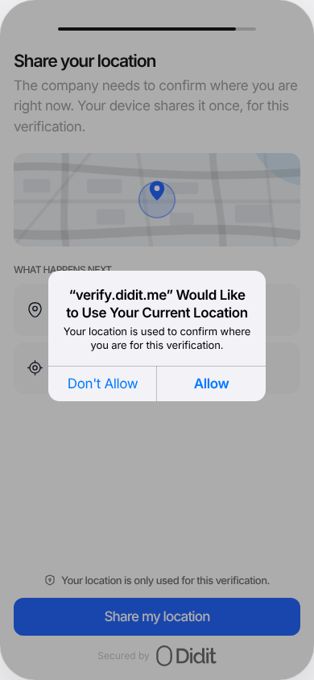 | 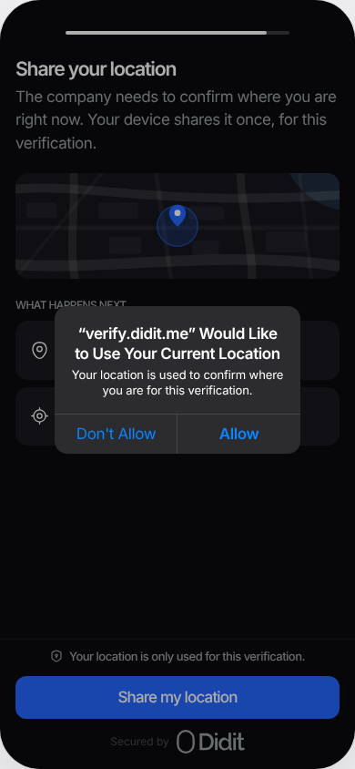 |
| Spanish | 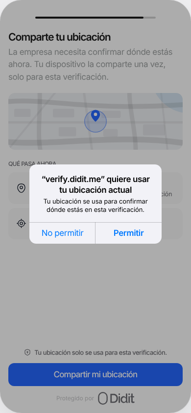 | 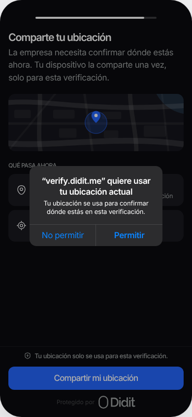 |

## README: Permissions intro and the "Bank and Location verification steps" section

Rendered with GitHub's markdown API and GitHub's markdown stylesheet, from `main` (before) and this branch (after). Only the changed region is shown; the camera and NFC permission blocks between the two parts are unchanged and left out.

| | Light | Dark |
|---|---|---|
| Before | 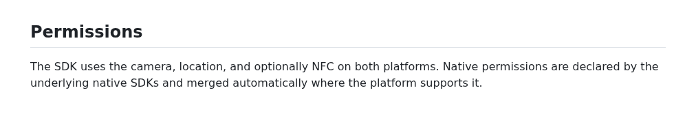 | 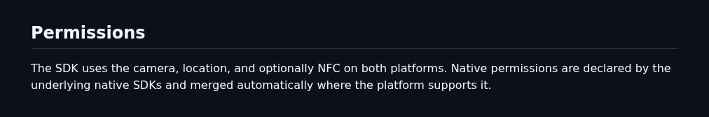 |
| After | 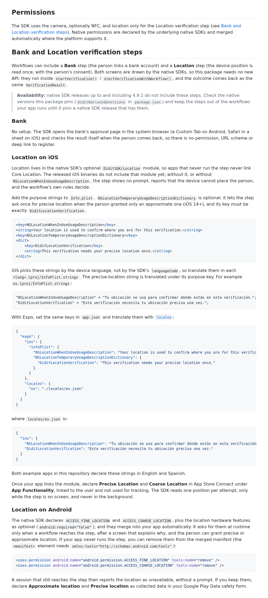 | 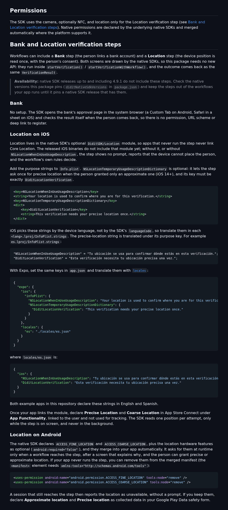 |

## README: Error Types table

The iOS bridge now reports `retryBlocked` (as Android already did), and the table documents it.

| | Light | Dark |
|---|---|---|
| Before | 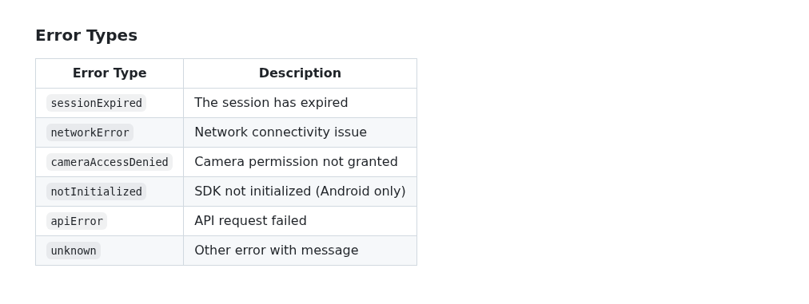 | 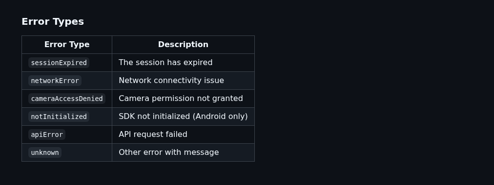 |
| After | 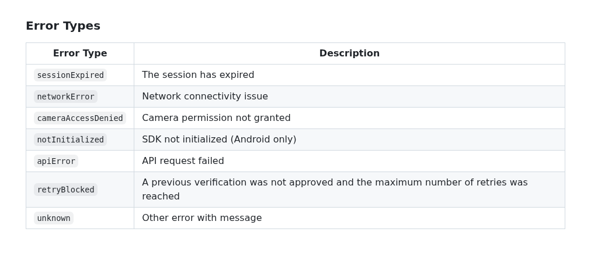 | 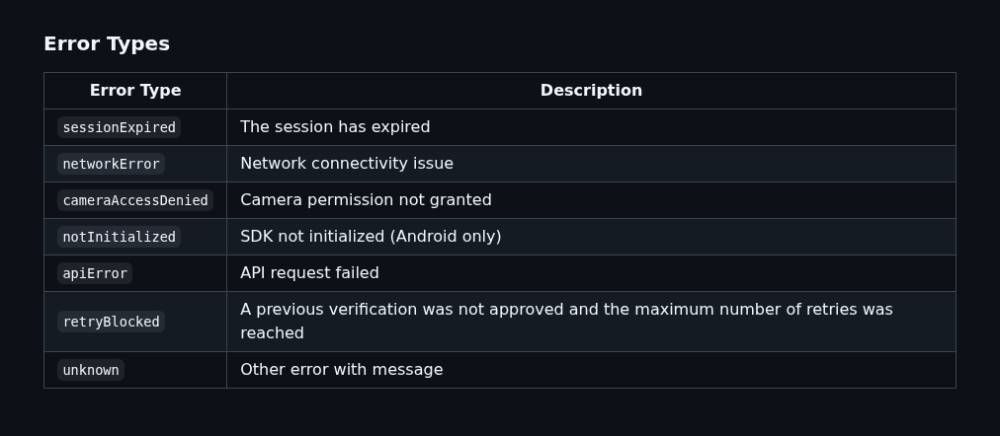 |
